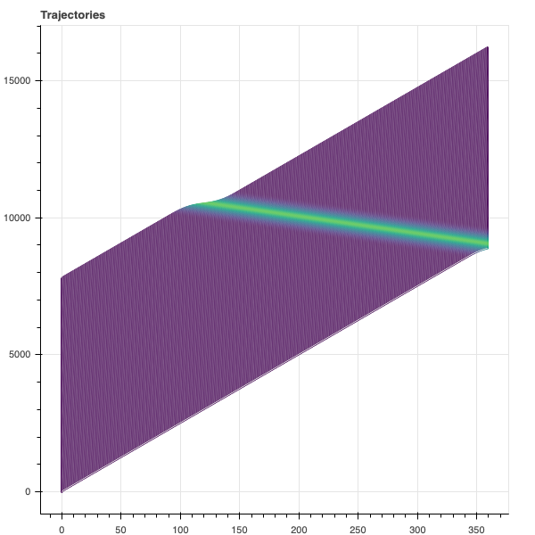
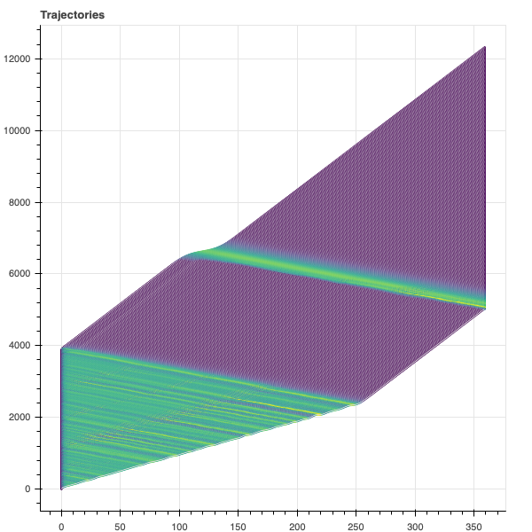

# Tampere - Car following simulation

[](https://mybinder.org/v2/gh/aladinoster/tampere.git/master?filepath=Simulation.ipynb)

Simulation of the Tampere's car following model and effect of stochastic parameters' on string stability. See [Simulation.ipynb](https://mybinder.org/v2/gh/aladinoster/tampere.git/master?filepath=Simulation.ipynb) for more details.

 

## Running locally

Check for dependencies in your default installation otherwise create a virtual environment in a [conda](https://docs.anaconda.com/anaconda/install/verify-install/) console. 

```{bash}
> conda env create -f environemnt.yaml
> conda activate tampere 
> jupyter labextension install jupyterlab_bokeh
```